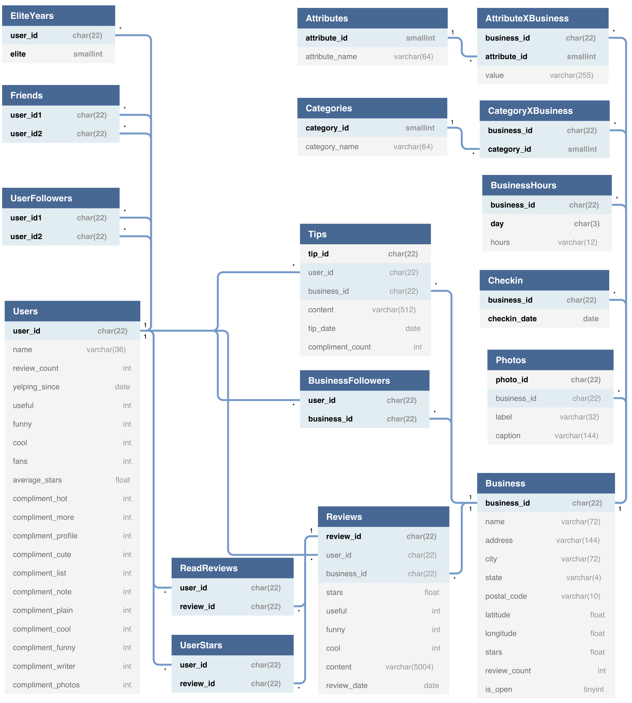
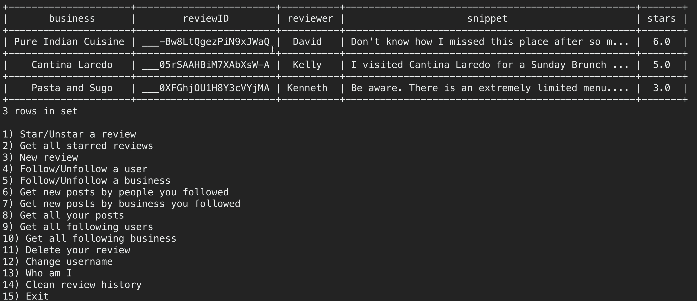
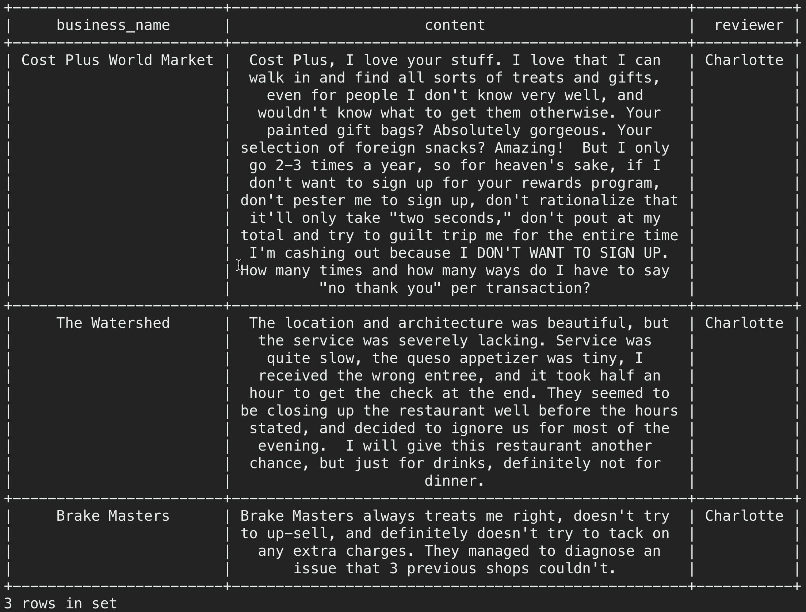
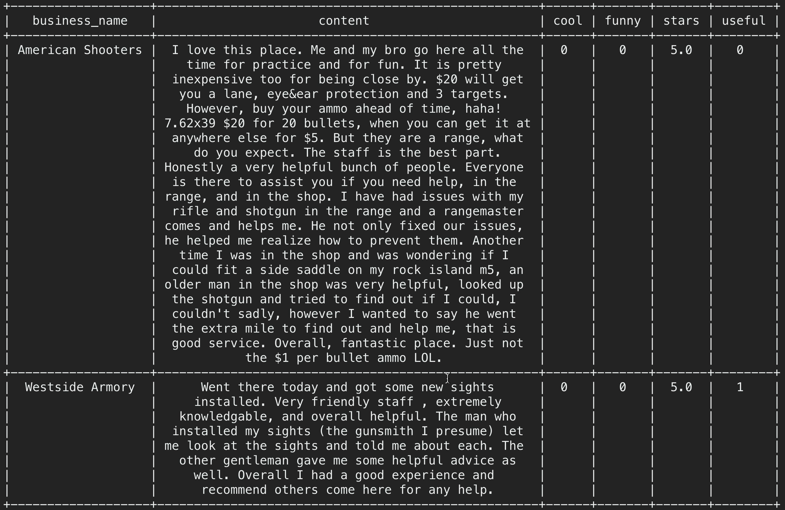
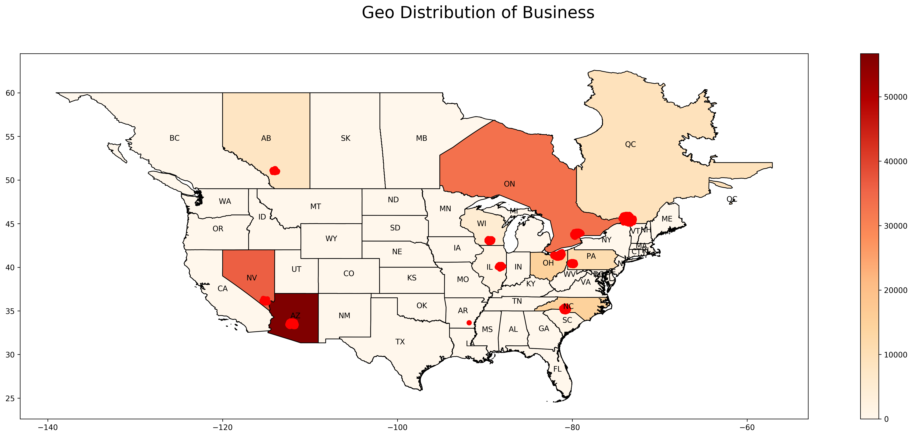

# Yelp-Dataset

A project to 

- build relational database of yelp dataset using MySQL

- build a simple server-client using Flask

- perform data mining on the dataset

# Dependencies

- Python3

- mysql-connector-python

- Flask

- prettytable

- numpy

- seaborn

- pandas

- geopandas

- sklearn

- wordcloud

# Usage

- 01 and 02: Data preprocessing and extraction

- 03: Dump data to mysql

- 04: Flask server and client

- 05: Data mining

# Demo

Detailed implementation and analysis can be found in 06_report/report.pdf

## ER Diagram

## Commandline Client

## Some plots

